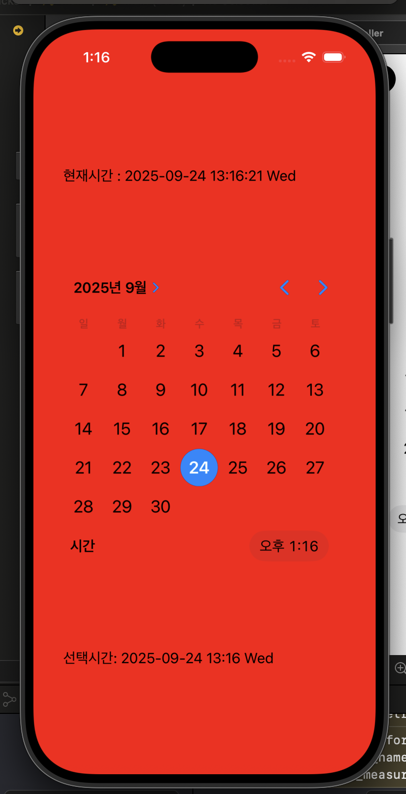

# ⏰ 알람 시계 (AlarmClock)

Swift와 Storyboard를 이용해 제작한 간단한 알람 시계 앱입니다.  
사용자가 설정한 알람 시간과 현재 시간이 일치하면 화면의 배경색이 변경됩니다.  

---

## 📌 주요 기능
- 현재 시간 표시
- DatePicker를 통한 알람 시간 설정
- 설정된 시간 도달 시 화면 배경색이 붉은색으로 변경
- 시간이 지나면 다시 흰색으로 복귀

---

## 🖼 실행 화면

### 1. 전체 화면 (앱 실행 시 현재 시간 표시)


### 2. 알람 발동 (배경색 붉게 변경)


### 3. 알람 시간 선택 (DatePicker)


---

## 🚀 실행 방법
1. 저장소 클론
   ```bash
   git clone https://github.com/dcuhanbin/AlarmClock.git
